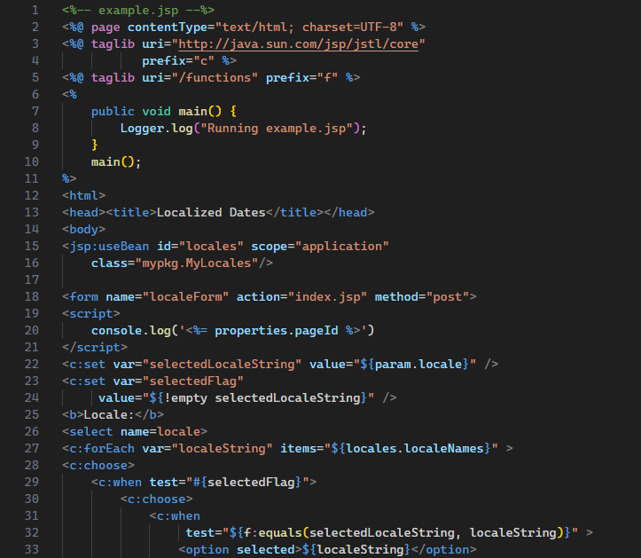

# JSP Language Support

This extension provides basic syntax highlighting support for Jakarta Server Pages (JSP; formerly JavaServer Pages) in VS Code.

Note that not all JSP patterns are handled. Contributions are welcome. Please open a pull request.
